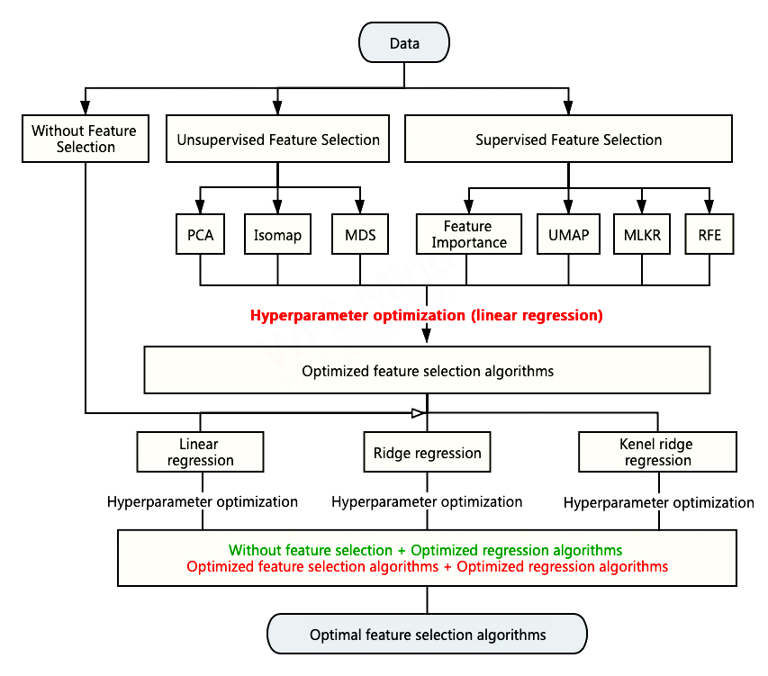

# cs-433-project-2-bio-chem-env-mater

The repository includes our work on Project 2 of CS-422 machine learning course at EPFL.

## Data

The data is larger than 100MB so it can't be uploaded to this Github repo. To get the data, please download it from [Google Drive](https://drive.google.com/file/d/15u8XO2vwm_XMYPjMembLa3VOrQxbpNVC/view?usp=sharing) and unzip it to the same folder as the jupyter notebooks.

## Jupyter notebooks

All implementations are written in form of jupyter notebooks. 

|Notebook|Content|Package needed (except `numpy`, `matplotlib`) |
|:---|:---|:---|
|Without Feature Selection.ipynb|Regressions with features selection|`sklearn`|
|Feature Selection_PCA.ipynb|Regressions with features selected by PCA|`sklearn`|
|Feature_Selection_Importance.ipynb|Regressions with feature selected by importance score|`sklearn`|
|Feature_Selection_RFE.ipynb|Regressions with features selected by recursive feature elimination|`sklearn`|
|Feature_Slection_UMAP.ipynb|Regressions with feature selected by UMAP|`sklearn`, `umap-learn`|
|Isomap.ipynb|Regressions with features selected by isomap|`sklearn`|
|MDS.ipynb|Regressions with features selected by multiple dimension scaling|`sklearn`|
|Metric Learning_MLKR.ipynb|Regressions with features selected by MLKR|`sklearn`, `metric_learn`|
|UMAP_visualization.ipynb|Visualize 2D UMAP embedding of original data|`sklearn`, `umap-learn`|

> **Remark**
> - Running some notebooks is time consuming (20 mins ~ 2 hours), such as Metric Learning_MLKR.ipynb, Feature_Slection_UMAP.ipynb and Feature_Selection_RFE.ipynb.

## Framework 

